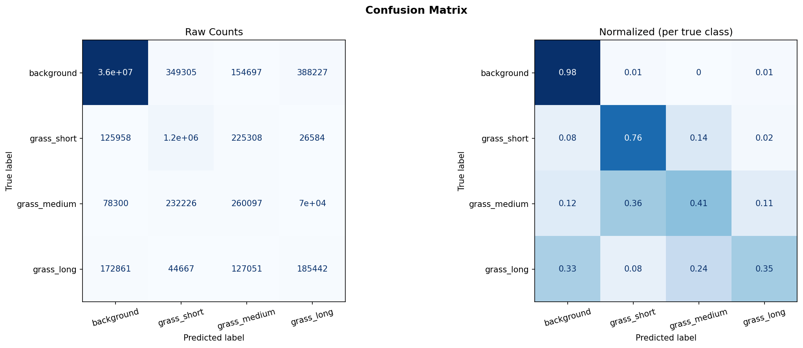
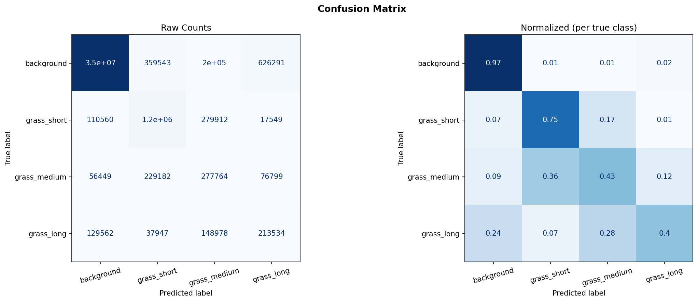
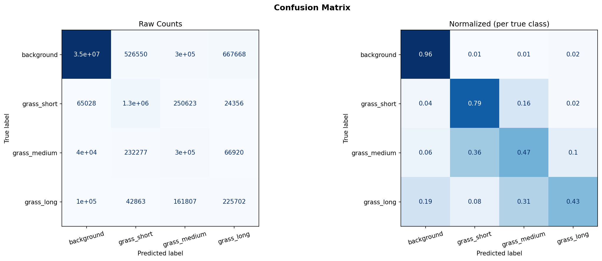

# Grass Segmentation Model
We train and compare three models to perform grass segmentation task on road image. 
- Type of segmentation: Semantic segmentation
- Data Splitting: 80% train, 10% val, 10% test
- Framework: Tensorflow 2.19.0, Keras 3.13.2

### Class label
- Class 0: background
- Class 1: grass_short
- Class 2: grass_medium
- Class 3: grass_long

### Getting started
1. Before training, run data preprocessing script:
```bash
cd src
model1_unet.ipynb
```
2. Train & evaluate models
- U-Net + MobileNetv2
```bash
cd src
model1_unet.ipynb
```
- Attention U-Net + MobileNetv2
```bash
cd src
model2_attention_unet.ipynb
```
- U-Net + ResNet50
```bash
cd src
model3_resnet50_unet.ipynb
```

### Test results
| Metrics | U-Net+MobileNetv2 | Attention U-Net+MobileNetv2 | U-Net+ResNet50 |
|:---|:---:|:---:|:---:|
| Mean IoU | 0.481 | 0.309 | 0.307 |
| Accuracy | 0.949 | 0.942 | 0.937 |
| Loss | 0.207 | 0.206 | 0.296 |

### Confusion Matrix
- U-Net + MobileNetv2

- Attention U-Net + MobileNetv2

- U-Net + ResNet50


### Hyperparameters
- image size: (256, 256)
- batch size: 32
- decoder size: [512 256 128 64 32]
- training epochs: 20+10
- class weigts: [0.19 0.92 1.33 1.57]
- dropout rate: 0.1
- learning rate: 3e-4 (Phase 1), 3e-5 (Phase 2)
- metrics: Categorical Accuracy, IoU
- optimizer: Adam
- augmentation: vertial flip, horizontal lfip, contrast, saturation, HUE
- early stopping: 12 (Phase 1), 3 (Phase 2)
- ReduceLROnPlateau: 5 (Phase 1), 2 (Phase 2)
- metrics: mean IoU (exlcude background), cateogrical accuracy
- loss: weighted CCE + focla loss + tversky loss
- random seed: 42